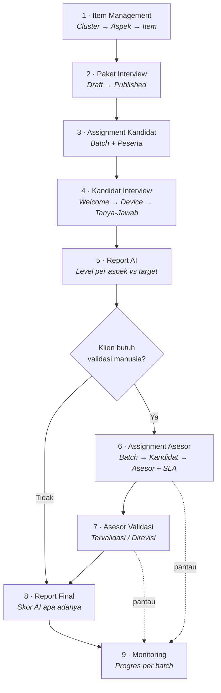

# Flow End-to-End — Interview AI + Validasi Asesor

> Dokumen ini memetakan alur lengkap dari penyusunan bank item sampai report yang
> sudah divalidasi asesor. Setiap fase dirujuk ke halaman & fungsi yang benar-benar
> ada di prototype, dan setiap langkah yang **belum** terimplementasi ditandai eksplisit
> di [Bagian 10 — Gap Implementasi](#10-gap-implementasi).

**Versi:** 1.1 · **Tanggal:** 16 September 2026 · **Status prototype:** HTML statis, state di `localStorage`, tanpa backend

---

## 1. Ringkasan Satu Layar



### Aktor

| Aktor | Peran | Halaman yang dipakai |
|---|---|---|
| **Admin / PIC Klien** | Menyusun item & paket, meng-assign kandidat, meng-assign asesor, memantau | `admin/item-management.html`, `admin/assignment.html`, `admin/monitoring.html` |
| **Kandidat / Peserta** | Menjalani interview AI | `01-welcome.html` → `02-device-check.html` → `03-interview.html` → `04-results.html` |
| **Asesor** | Memvalidasi / merevisi skor AI | ⚠️ *Belum ada halaman — lihat Gap #2* |
| **Sistem AI** | Menilai jawaban terhadap rubrik aspek | `api/evaluate.js` |

---

## 2. Fase 1 — Item Management

**Halaman:** `admin/item-management.html` → tab **Bank Item**
**Storage:** `admin_item_mgmt_v1`

### Hierarki data

```
Cluster  (mis. "Soft Skills", "Technical Skills")
  └── Aspek  (mis. "Problem Solving" — punya RUBRIK 5 level)
        └── Item Pertanyaan  (mis. "Ceritakan saat Anda…")
```

### Bentuk data

| Entitas | Field | Catatan |
|---|---|---|
| **Cluster** | `id`, `nama`, `warna`, `desc` | Warna dipilih dari 8 preset. Default: `CL1` Soft Skills, `CL2` Technical Skills |
| **Aspek** | `code`, `name`, `clusterId`, `category` (`soft`/`technical`), `desc`, `levels[5]`, `status` | **`levels[5]` adalah rubrik L1–L5 — inilah yang dibaca AI untuk menilai jawaban** |
| **Item** | `id` (`Q001`…), `aspect`, `text`, `tipe` (`suara`), `durasi` (detik), `ulang`, `status` | Item selalu menempel ke satu aspek |

### Aturan & guardrail yang berlaku

1. Item baru selalu tersimpan sebagai **Draft**; diaktifkan lewat toggle di baris item (`Draft ↔ Aktif`).
2. Cluster **tidak bisa dihapus** selama masih ada aspek di dalamnya.
3. Mengubah rubrik aspek yang sedang dipakai **paket berstatus Published** memunculkan konfirmasi — sistem menyarankan membuat **versi baru paket** ketimbang mengubah rubrik yang sudah terpakai. Alasannya: mengubah rubrik secara diam-diam membuat skor kandidat lama dan baru tidak lagi setara.
4. Item/aspek berstatus `Archived` tidak lagi muncul di penyusunan paket.

**Output fase ini:** bank item yang siap dirakit jadi paket.

---

## 3. Fase 2 — Paket Interview

**Halaman:** `admin/item-management.html` → tab **Paket Interview** (`#paket`)
**Storage:** `admin_item_mgmt_v1` → `DB.paket[]`

### Bentuk data

```js
{
  id: 'P1',
  nama: 'Sales Hunter v1',
  status: 'Draft' | 'Published' | 'Archived',
  locked: false,          // true = read-only, sudah dipakai produksi
  assigned: false,        // true = sudah pernah di-assign ke kandidat
  showResult: false,      // kandidat boleh lihat hasilnya sendiri atau tidak
  items: [
    { itemId: 'Q001', target: 4, bobot: 'Tinggi' }   // target L1–L5, bobot Rendah/Sedang/Tinggi
  ]
}
```

### Siklus hidup paket

```
  [Paket Baru] ──save──> Draft ──publish──> Published ──archive──> Archived
                           ▲                    │
                           └──── duplikat ──────┘
                            (jadi "… v2", Draft, locked:false)
```

### Aturan & guardrail

| Aturan | Implementasi |
|---|---|
| Paket kosong tidak bisa di-publish | `publishPaket()` → toast *"Paket kosong — tambah item dulu"* |
| Semua item di dalam paket harus berstatus **Aktif** sebelum publish | `publishPaket()` → toast *"Guardrail: semua item harus Aktif sebelum publish"* |
| Paket `locked` bersifat read-only | Field nama, toggle *show result*, tombol tambah item di-disable; tombol **Simpan** disembunyikan |
| Mengubah paket yang sudah dipakai | Gunakan **Duplikat** → menghasilkan versi baru (`v2`, `v3`, …) berstatus Draft dan `locked:false` |
| Setiap item di paket punya **target level** dan **bobot** sendiri | Target inilah pembanding skor AI nanti (`level >= target` = tercapai) |

**Output fase ini:** paket berstatus `Published` yang bisa dipilih di dropdown Assignment.

---

## 4. Fase 3 — Assignment Kandidat

**Halaman:** `admin/assignment.html` → tab **Assignment Kandidat**
**Storage:** `admin_assignment_v1` (array flat, 1 record per kandidat)

### Langkah admin

**Kartu 1 — Informasi Batch**

| Field | Wajib | Catatan |
|---|:---:|---|
| Nama Batch | ✅ | Jadi pengelompok; kombinasi `paketId + batchName` = identitas batch |
| Tanggal & Jam Mulai | ✅ | Jam default `08:00` |
| Tanggal & Jam Selesai | ✅ | Jam default `17:00`; tidak boleh sebelum tanggal mulai |
| Paket Interview | ✅ | Dropdown dari `admin_item_mgmt_v1` |
| Subdomain | — | Untuk URL undangan |
| Cluster (chips) | — | Penanda opsional |

**Kartu 2 — Input Peserta** (dua sub-tab)

*Upload Excel:*
- Format `.xlsx` / `.xls` saja
- Header wajib memuat kolom yang mengandung kata **`name`** dan **`email`** (case-insensitive)
- Email duplikat dilewati diam-diam dan dilaporkan di ringkasan upload (*"N peserta dimuat, M duplikat dilewati"*)
- Batas **300 peserta** per batch
- Tersedia tombol **Download Template** (`template-peserta.xlsx`)

*Input Manual:*
- Nama + Email, divalidasi format email dan dicek duplikat terhadap daftar yang sedang disusun
- Batas 300 peserta sama

### Validasi saat Submit

Urutan pengecekan di `submitForm()`:

1. Nama Batch wajib diisi
2. Tanggal Mulai wajib diisi
3. Tanggal Selesai wajib diisi
4. Tanggal Selesai tidak boleh sebelum Tanggal Mulai
5. Paket Interview wajib dipilih
6. Minimal 1 peserta

### Record yang dihasilkan (per peserta)

```js
{
  id: 'A1757…_0',
  paketId, batchName, periodStart, periodEnd, deadline, subdomain, clusters,
  nama, email, wa: '', lang: 'id',
  token: 'xY7kP2mQ…',        // 16 karakter, jadi kunci akses link interview
  status: 'Assigned',
  channel: 'manual',
  createdAt, updatedAt,
  log: [{ ts, msg: 'Assigned via batch: …' }]
}
```

Setelah sukses: toast *"N peserta berhasil di-assign!"*, form direset otomatis setelah 1,5 detik.

**Output fase ini:** N kandidat berstatus `Assigned` dengan token akses masing-masing.

---

## 5. Fase 4 — Kandidat Menjalani Interview

**Halaman:** `01-welcome.html` → `02-device-check.html` → `03-interview.html`

### 4a. Welcome
Kandidat masuk lewat link bertoken. Ditampilkan instruksi *"Cara menjawab dengan baik"* dan gambaran alur.

### 4b. Device Check
Pengecekan sebelum mulai — **kamera**, **mikrofon**, **browser**. Interview tidak bisa dimulai sebelum perangkat lolos.

### 4c. Sesi Interview

Per pertanyaan, siklusnya:

```
  AI membacakan pertanyaan (text-to-speech + highlight karaoke)
        ↓
  Kandidat merekam jawaban (video + audio)
        ↓
  Speech recognition → transkrip real-time
   └─ fallback: input teks manual bila browser tidak mendukung
        ↓
  Timer 120 detik per jawaban (dari field `durasi` item)
        ↓
  Review jawaban → kirim, atau ulangi (dibatasi `MAX_ATTEMPTS`)
        ↓
  Transkrip dikirim ke api/evaluate.js bersama RUBRIK aspek
        ↓
  Kembali ke pertanyaan berikutnya
```

Progres sesi disimpan di `sessionStorage` (`currentQ`, `results`) supaya reload tidak mengulang dari nol.

### Status kandidat sepanjang fase ini

```
Assigned ──undangan terkirim──> Invited ──mulai──> In Progress ──selesai──> Completed
                                    │
                                    └──lewat deadline──> Expired
```

**Output fase ini:** kandidat berstatus `Completed` dengan transkrip jawaban lengkap.

---

## 6. Fase 5 — Report AI Keluar

**Halaman:** `04-results.html` (tampilan untuk kandidat, bila `paket.showResult = true`)
**Generator (admin/prototype):** `AD.buildAiReport()` di `admin/assessor-data.js`

### Isi report per aspek

| Field | Arti |
|---|---|
| `aspect` / `aspectName` | Kode & nama aspek |
| `level` | Level hasil penilaian AI, **1–5** |
| `label` | Label level (dari `FRAMEWORK.levelLabels`) |
| `target` | Target level dari paket |
| `weight` | Bobot aspek (Rendah / Sedang / Tinggi) |
| `rationale` | Alasan AI atas level yang diberikan |

### Agregat

| Field | Rumus |
|---|---|
| `achieved` | Jumlah aspek dengan `level >= target` |
| `total` | Jumlah aspek dinilai |
| `avgLevel` | Rata-rata level, dibulatkan 1 desimal |
| `ready` | `true` = report siap dan bisa di-assign ke asesor |

`04-results.html` menampilkan per aspek: level vs target, selisih (`gap`), status tercapai/di bawah target, dan daftar **focus area** untuk aspek yang belum memenuhi target.

**Output fase ini:** `candidate.aiReport.ready === true` — kandidat masuk pool yang bisa ditugaskan ke asesor.

---

## 7. Fase 6 — Assignment Asesor

**Halaman:** `admin/assignment.html` → tab **Assignment Asesor** (deep link: `assignment.html#asesor`)
**Storage:** `admin_assessor_task_v1`

### Konsep batch

Batch **tidak disimpan sebagai entitas sendiri** — ia diturunkan dari kandidat:

```js
batchId = 'b_' + paketId + '_' + slug(batchName)
```

Semua kandidat dengan `paketId` + `batchName` yang sama dianggap satu batch.

### Kesiapan batch (`readiness`)

| Nilai | Syarat | Bisa dipilih? |
|---|---|:---:|
| **Siap** | Semua kandidat report AI-nya sudah siap (`reportReady === total`) | ✅ |
| **Sebagian Siap** | Sebagian saja yang siap (`0 < reportReady < total`) | ✅ (hanya yang siap) |
| **Belum Siap** | Tidak ada report AI sama sekali (`reportReady === 0`) | ❌ *"Report AI belum tersedia — kandidat belum menyelesaikan interview"* |
| *(habis)* | `assignableCount === 0` | ❌ *"Semua kandidat sudah ditugaskan"* |

### Langkah admin

**Kartu 1 — Pilih Batch.** List satu kolom (bukan grid) berisi batch beserta badge kesiapan; yang masih punya kandidat siap-tugas naik ke atas. Setiap baris merangkum progresnya sebagai satu angka **`X/Y ditugaskan`** (X = kandidat yang sudah ditugaskan, Y = kandidat yang report AI-nya sudah siap) — tanpa merinci "report AI siap" sebagai angka terpisah. Kalau batch lebih dari 10, list-nya berpindah halaman (10 batch/halaman); mengetik di kolom pencarian otomatis mengembalikan ke halaman pertama.

**Kartu 2 — Pilih Kandidat.** Hanya menampilkan kandidat yang `aiReport.ready === true` **dan** belum pernah ditugaskan di batch tersebut. Tersedia pilih-semua; kolom yang tampil per kandidat adalah nama, tanggal **Interview Selesai** (`aiReport.generatedAt`), dan status (siap divalidasi / sudah ditugaskan ke siapa / report belum siap) — tidak ada kolom skor AI di sini, supaya keputusan menugaskan tidak bias oleh angka AI sebelum divalidasi.

**Kartu 3 — Asesor & SLA.**

| Field | Wajib | Catatan |
|---|:---:|---|
| Nama Asesor | ✅ | Input bebas, dengan **saran** dari riwayat penugasan sebelumnya |
| Email Asesor | ✅ | Divalidasi format; **email inilah identitas asesor** |
| Tanggal Mulai | ✅ | Default hari ini |
| Deadline SLA | ✅ | Default +7 hari; tidak boleh sebelum tanggal mulai |

> ⚠️ **Penting:** platform belum punya master data / registry asesor. Karena itu asesor
> **tidak punya `id`** — identitasnya adalah email (dinormalkan lowercase) dan namanya
> diinput bebas oleh admin. Saran nama di form adalah riwayat pemakaian, **bukan** master data.
> Konsep kapasitas/beban asesor belum bisa dihitung sampai registry-nya benar-benar ada.

### Validasi `AD.assign()`

| # | Cek | Pesan gagal |
|---|---|---|
| 1 | Batch ditemukan | `Batch tidak ditemukan` |
| 2 | Minimal 1 kandidat | `Pilih minimal 1 kandidat` |
| 3 | Nama asesor terisi | `Nama asesor wajib diisi` |
| 4 | Email asesor terisi | `Email asesor wajib diisi` |
| 5 | Format email valid | `Format email asesor tidak valid` |
| 6 | Tanggal mulai terisi | `Tanggal mulai wajib diisi` |
| 7 | Deadline terisi | `Deadline SLA wajib diisi` |
| 8 | `slaDue >= slaStart` | `Deadline tidak boleh sebelum tanggal mulai` |
| 9 | Ada kandidat valid tersisa | `Kandidat terpilih sudah di-assign atau report AI belum siap` |

### Record yang dihasilkan

Satu kali submit = satu **`groupId`** + N **task** (`VT1`, `VT2`, …), satu task per kandidat:

```js
{
  id: 'VT12', groupId: 'g12_rina-kusuma-assessor-id_b_P1_…',
  assessorName, assessorEmail,
  batchId, batchName, paketId, paketName,
  candidateId, candidateName, candidateEmail,
  aiSummary: { achieved, total, avgLevel },   // snapshot skor AI saat ditugaskan
  status: 'Menunggu',
  assignedAt, slaStart, slaDue,
  note: '',   // form Assignment Asesor sudah tidak punya field Catatan — AD.assign() masih menerima note kalau dipanggil langsung
  startedAt: null, validatedAt: null, revisedAspects: 0,
  log: [{ ts, msg: 'Ditugaskan ke … · deadline …' }]
}
```

Setelah sukses, **batch tetap terpilih** supaya admin bisa langsung menugaskan kelompok berikutnya ke asesor lain; field kandidat dan asesor direset.

Halaman Assignment sendiri **tidak lagi menampilkan daftar penugasan yang sudah ada** pada suatu batch (dulu ada kartu "Penugasan pada Batch Ini" + link "Lihat penugasan batch ini →" untuk batch terkunci — keduanya sudah dihapus). Untuk memantau atau melihat progres penugasan, admin cek langsung ke **Monitoring**. Konsekuensinya: kemampuan membatalkan grup penugasan (`AD.cancelGroup()`) jadi tidak punya pemicu UI di halaman manapun untuk saat ini — lihat Gap #9.

**Output fase ini:** N task validasi berstatus `Menunggu` dengan SLA melekat.

---

## 8. Fase 7 — Asesor Memvalidasi Report

> ⚠️ **Halaman asesor belum dibangun.** Bagian ini adalah spesifikasi alur yang sudah
> didukung struktur datanya — status, `revisedAspects`, `validatedAt`, dan `log` sudah ada
> di model task dan sudah dirender di Monitoring; yang belum ada adalah layar tempat asesor
> benar-benar mengerjakannya. Lihat Gap #2.

### Siklus hidup task validasi

```
  Menunggu ──asesor membuka──> Sedang Direview ──┬──> Tervalidasi   (skor AI disetujui apa adanya)
                                                 └──> Direvisi      (≥1 aspek diubah asesor)
```

`AD.DONE_STATUS = ['Tervalidasi', 'Direvisi']` — keduanya dihitung **selesai**.

### Yang dilakukan asesor per kandidat

1. Membuka task dari daftar tugasnya (difilter berdasarkan email asesor)
2. Menonton/membaca transkrip jawaban kandidat per pertanyaan
3. Membandingkan **level yang diberikan AI** dengan **rubrik aspek** dan target paket
4. Untuk tiap aspek: **setujui** level AI, atau **revisi** level + tulis alasan revisi
5. Submit:
   - Tidak ada aspek diubah → status **`Tervalidasi`**, `revisedAspects = 0`
   - Ada aspek diubah → status **`Direvisi`**, `revisedAspects = jumlah aspek yang diubah`
6. `validatedAt` diisi, entri baru masuk ke `log`

### SLA

| State | Syarat | Dipakai untuk |
|---|---|---|
| `done` | `done >= total` | Badge "Selesai" |
| `overdue` | Deadline sudah lewat (`days < 0`) | Naik ke urutan teratas di Monitoring |
| `atrisk` | Sisa `<= 2` hari (`AD.AT_RISK_DAYS`) | Badge peringatan |
| `ontrack` | Sisanya | — |

Teks countdown: *"3 hari lagi"* / *"jatuh tempo hari ini"* / *"lewat 2 hari"* / *"selesai"*.

**Output fase ini:** task berstatus `Tervalidasi` atau `Direvisi`.

---

## 9. Fase 8 & 9 — Report Final dan Monitoring

**Halaman:** `admin/monitoring.html`

### Status scoring per batch

Diturunkan otomatis di `AD.batchRows()` — **bukan** field yang disimpan:

| Status internal | Syarat | Label yang tampil di kartu |
|---|---|---|
| **Belum Siap** | `reportReady === 0` — belum ada report AI sama sekali | "Belum Discoring" |
| **Belum Discoring** | Report AI siap, tapi belum ada task asesor sama sekali | "Belum Discoring" |
| **Sedang Discoring** | Ada task, tapi belum semuanya selesai (atau masih ada report siap yang belum ditugaskan) | "Sedang Discoring" |
| **Selesai Discoring** | Semua task selesai **dan** jumlah task = jumlah report siap | "Selesai Discoring" |

`Belum Siap` dan `Belum Discoring` sengaja ditampilkan dengan **label yang sama** — dari sudut pandang admin keduanya sama-sama berarti "batch ini belum discoring", bedanya cuma kenapa (report belum ada vs report ada tapi belum ada asesor). Ini murni penyesuaian tampilan di `monitoring.html` (fungsi `scoringLabel()`); nilai `AD.SCORING.BELUM_SIAP` di data layer **tidak diubah**, supaya urutan sortir kartu di bawah ini tetap benar.

Urutan kartu: batch **overdue** dulu → Sedang Discoring → Belum Discoring → Belum Siap → Selesai Discoring terakhir (urutan ini berdasarkan status internal, bukan label yang tampil).

### Isi kartu batch

Header (selalu terlihat): badge status scoring · nama batch · periode · jumlah peserta · progress bar.
Body (saat dibuka): pencarian + filter, lalu tabel kandidat dengan kolom:

| Kolom | Isi |
|---|---|
| **Peserta** | Avatar berinisial + nama + email |
| **Interview** | Status kandidat: `Invited` / `In Progress` / `Completed` / `Expired` / `Cancelled` |
| **Asesor** | Avatar + nama asesor yang menilai (`–` bila belum ditugaskan) |
| **Status Validasi** | `Belum Ditugaskan` / `Menunggu` / `In Progress` / `Completed` — disederhanakan biar seragam dengan kolom Interview: status internal `Sedang Direview` tampil sbg `In Progress`; `Tervalidasi` **dan** `Direvisi` sama-sama tampil sbg `Completed` (yang penting buat admin cuma selesai/belum, bukan tahapan internalnya) |

### Report final

Titik akhir alur ada dua jalur:

- **Tanpa validasi asesor** — report AI langsung jadi report final (`04-results.html`).
- **Dengan validasi asesor** — report final = skor setelah asesor menyetujui atau merevisi, ditandai `Tervalidasi` / `Direvisi` beserta nama asesor dan waktu validasi. Jejaknya ada di `task.log`.

> ⚠️ Artefak "report final tervalidasi" yang bisa diunduh / dikirim ke klien **belum ada** — lihat Gap #5.

---

## 10. Gap Implementasi

Daftar jujur hal yang **belum** ada, supaya dokumen ini tidak dibaca seolah seluruh alur sudah jalan.

| # | Gap | Dampak | Status |
|---|---|---|---|
| **1** | Hasil interview nyata hanya disimpan di `sessionStorage` dan tidak pernah dipersist | Tidak ada report asli yang bisa divalidasi. Di admin, report AI dibangkitkan **mock deterministik** dari `id` kandidat lewat `AD.buildAiReport()` agar angkanya stabil tiap reload | Perlu backend |
| **2** | **Halaman asesor belum ada** | Transisi `Menunggu → Sedang Direview → Tervalidasi/Direvisi` saat ini hanya berasal dari data seed, bukan dari aksi asesor sungguhan | Perlu dibangun |
| **3** | Tidak ada master data / registry asesor | Asesor tidak punya `id`; identitas = email, nama diinput bebas. Kapasitas & beban kerja asesor belum bisa dihitung | Keputusan produk |
| **4** | Tidak ada mekanisme undangan | Token kandidat dibuat, tapi email/WA undangan (kandidat maupun asesor) belum dikirim ke mana pun | Perlu backend |
| **5** | Tidak ada artefak report final | Report tervalidasi belum bisa diunduh, dibagikan, atau dikirim ke klien | Perlu dibangun |
| **6** | Tidak ada autentikasi & role | Semua halaman admin terbuka; belum ada pemisahan Admin / Asesor / Klien | Perlu backend |
| **7** | `admin_item_mgmt_v1` baru ditulis ke `localStorage` **setelah** admin mengubah sesuatu di Item Management | Di browser baru, dropdown Paket di Assignment Kandidat bisa tampil kosong meski halaman Item Management sudah pernah dibuka. Bawaan lama repo, bukan regresi | Bug kecil, perlu diperbaiki |
| **8** | Bentuk `admin_assignment_v1` tidak konsisten | Ditulis sebagai array flat, sementara kode lama membacanya sebagai `{assignments:[]}`. `AD.readCandidates()` menoleransi keduanya sebagai jembatan | Utang teknis |
| **9** | Membatalkan grup penugasan tidak punya pemicu UI | `AD.cancelGroup()` masih ada di data layer, tapi kartu "Penugasan pada Batch Ini" (dulu di Assignment, lengkap dengan tombol Batalkan) sudah dihapus supaya Assignment "straight to the point". Monitoring pun read-only. Admin tidak punya cara membatalkan penugasan asesor dari UI manapun | Perlu dibangun (mis. tombol batal di Monitoring) |

---

## 11. Peta Storage

| Key | Ditulis oleh | Dibaca oleh | Isi |
|---|---|---|---|
| `admin_item_mgmt_v1` | `item-management.html` | `item-management.html`, `assignment.html` (dropdown paket), `assessor-data.js` (`paketName()`) | `{ clusters, aspects, items, paket, seq }` |
| `admin_assignment_v1` | `assignment.html` (tab Kandidat) | `assessor-data.js`, `monitoring.html` | Array kandidat |
| `admin_assessor_task_v1` | `assessor-data.js` (`assign()`, `cancelGroup()`) | `assignment.html` (tab Asesor), `monitoring.html` | `{ tasks[], seq }` |
| `admin_assessor_seed_v1` | `assessor-data.js` | `assessor-data.js` | `{ version, seededAt }` — penanda versi data demo |

**Catatan seed:** `AD.SEED_VERSION` harus dinaikkan setiap kali `DEMO_BATCHES` / `DEMO_GROUPS` diubah. Tanpa itu, browser yang sudah pernah membuka halaman akan terus memakai data demo versi lama, karena `ensureData()` hanya menyemai saat `localStorage` kosong.

---

## 12. Peta Halaman

| Halaman | Menu | Isi |
|---|---|---|
| `admin/item-management.html` | **Item Management** + **Paket Interview** | Dua tab dalam satu file |
| `admin/assignment.html` | **Assignment** | Dua tab: *Assignment Kandidat* & *Assignment Asesor* (`#asesor`) |
| `admin/monitoring.html` | **Monitoring** | Kartu per batch + tabel kandidat |
| `admin/assessor-data.js` | — | Data layer bersama (global `AD`) |
| `01-…` s/d `04-results.html` | — | Alur kandidat |
| `api/evaluate.js` | — | Endpoint penilaian AI |
